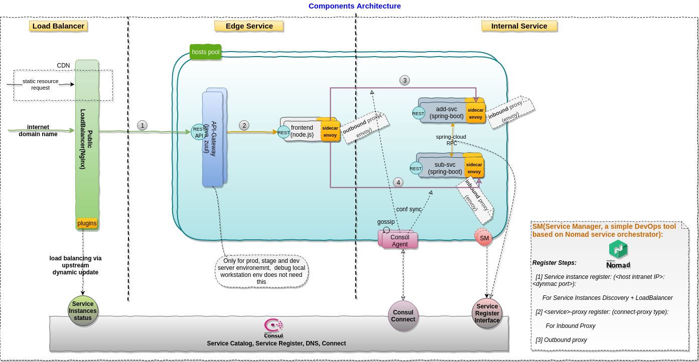
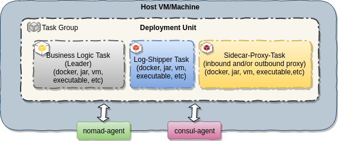
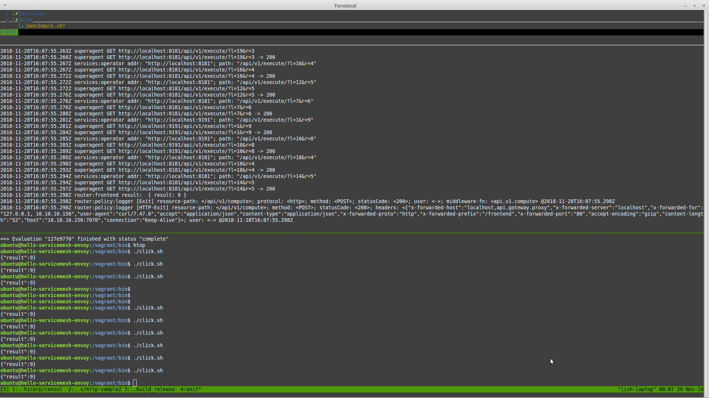

## Introduction

The purpose of this repository aims to provide a hands-on architecture PoC(proof-of-concept) sample that demonstrate how to **build** and **run** a `microservices architecture`(MSA) application(multiple programming languages) with the capabilities of service registry, naming resolution, client service disovery, client load balance, traffic shapping, failure tolerance, etc. 

## PoC Scenario 

The sample contains Java and Node.js modules. In reality, the RPC framework usually are programming language specific, so the challenge for us is how to enable a MSA application with mixed-languages. This sample will show you the approach of service fabric(servicemesh) pattern.

>
> The sample is based on consul connect for the serviemesh. We want to use it to demonsrate the service mesh concepts for a hybrid environments(docker is not the only packing method, mixed deployable types for the service orchestration which could not be achieved by k8s only. cloud-native and on-premise co-exists). Please note, Consule connect was introduced in Consul 1.2 and be marked as beta quality for now, thus, not ready to be used in a production environment.

### Overview



### Sidecar Tasks 



### Quick Start

- Prerequisites 
  - Envoy executable binary(following the [guide](https://github.com/envoyproxy/envoy/tree/master/ci) for a developer build)
  - socat is installed

- Launch a TCP echo server with socat

  ```
  socat -v tcp-l:9090,fork exec:"/bin/cat"
  ```

- Define consul config definitions to file "envoy\_demo.hcl"
  ```
  services {
  	name = "client"
  	port = 8080
  	connect {
  		sidecar_service {
  			proxy {
  				upstreams {
  					destination_name = "echo"
  					local_bind_port = 9191
  				}
  			}
  		}
  	}
  }
  
  services {
  	name = "echo"
  	port = 9090
  	connect {
  		sidecar_service {}
  	}
  }
  ```

- Launch consul
  ```shell
	cd /vagrant/deployable/
  /opt/consul/bin/consul agent -dev --config-file ./envoy_demo.hcl
  ```
- Start envoy inbound and outbound proxies:

  - Inbound

  ```bash
  /opt/consul/bin/consul connect envoy -sidecar-for echo -admin-bind localhost:19000 -bootstrap > ./bootstrap_echo.json 
  /opt/envoy/bin/envoy --v2-config-only --config-path ./bootstrap_echo.json --disable-hot-restart -l debug
  ```

  Alternative	

  ```bash
  /opt/consul/bin/consul connect envoy -sidecar-for echo -admin-bind localhost:19000 -envoy-binary=/opt/envoy/bin/envoy -- -l debug
  ```

	- Outbound

  ```bash
	/opt/consul/bin/consul connect envoy -sidecar-for client -admin-bind localhost:19001 -bootstrap > ./bootstrap_client.json
	/opt/envoy/bin/envoy --v2-config-only --config-path ./bootstrap_client.json --disable-hot-restart -l debug
	```
  
	Alternative	

	```bash
	/opt/consul/bin/consul connect envoy -sidecar-for client -admin-bind localhost:19001 -envoy-binary=/opt/envoy/bin/envoy -- -l debug
	```

- Run a client on `9191` port

  ```bash
  nc 127.0.0.1 9191
  ```

### Run the Sample 

All of service instances are using dynamic ports in this sample to demonstrate the auto-scale features. 

> 
> By the time being, the service stanza does not support connect sidecar\_service definitions. so we do not have a easy way to enable dynamical port feature. In this sample, the ports for frontend, add-svc and sub-svc are static, and all of services are running with single instance, no replicated service instances running.

#### Steps

- Prerequisites 
  - Java
  - Node.js
  - Gradle
  - Envoy executable binary(following the [guide](https://github.com/envoyproxy/envoy/tree/master/ci) for a developer build)

- Git clone the project

	On host:
  ```shell
  git clone git@github.com:leezhenghui/hello-servicemesh-envoy.git
  ```

- Gradle build/deploy distribution
  
  On host:
  ```shell
  cd hello-servicemesh-envoy/modules/frontend
  npm install
  cd ../../
  gradle deploy 
  ```

- Launch VM 
  
	On host:
	```shell
	cd ops
	vagrant up
  ```

- Provision the VM 
  
	On host:
	```shell
	vagrant provision 
  ```

- Start all nomad jobs 

  For each services, two intances will be created for a load balance, service discovery testing
  
	On host:

	```shell
  vagrant ssh
  ```

	In VM
	```shell
  cd /vagrant/bin
	./start_all_jobs.sh
	```

	```
  {
    "name": "add-svc-proxy",
    "kind": "connect-proxy",
    "proxy": {
       "destination_service_name": "add-svc",
       "local_service_address": "10.10.10.150",
       "local_service_port": 9090
     },
     "port": 21000
  }
	```

	```
  {
    "name": "sub-svc-proxy",
    "kind": "connect-proxy",
    "proxy": {
      "destination_service_name": "sub-svc",
      "local_service_address": "10.10.10.150",
      "local_service_port": 8080
    },
    "port": 21001
  }
	```

	```
  {
    "name": "add-svc-ref-proxy",
    "kind": "connect-proxy",
    "proxy": {
       "destination_service_name": "frontend",
       "local_service_address": "10.10.10.150",
       "local_service_port": 7070,
       "upstreams": [{
          "destination_type": "service",
          "destination_name": "add-svc",
          "local_bind_address": "127.0.0.1",
          "local_bind_port": 9191
        }]
     },
	   "port": 21002
  }
	```

	```
	{
    "name": "sub-svc-ref-proxy",
    "kind": "connect-proxy",
    "proxy": {
       "destination_service_name": "frontend",
       "local_service_address": "10.10.10.150",
       "local_service_port": 7070,
       "upstreams": [{
          "destination_type": "service",
          "destination_name": "sub-svc",
          "local_bind_address": "127.0.0.1",
          "local_bind_port": 8181
        }]
      },
      "port": 21003
	}
	```

- Run the sample 

  In VM:
	```shell
	./click.sh
  ```

- Run benchmark 

  In VM:
	```shell
	./benchmark.sh
  ```

#### Result of Service Discovery and Load Balance


